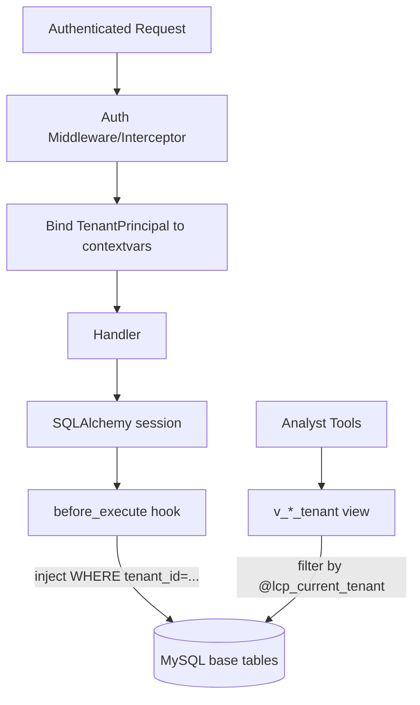

# LCP Security Design — OAuth2/OIDC + mTLS + Multi-Tenant RLS

> **Audience:** Platform engineers, security reviewers, integration partners
> **Status:** Phase-1 design (skeleton landed; production hardening pending)
> **Owners:** Lance-Laker Team

This document describes how the LanceDB Control Plane (LCP) authenticates,
authorises, and isolates traffic. It covers four planes:

1. **North-bound** — End users / tenant admins → LCP REST API
2. **East-west** — LCP services ↔ Worker pools / VDW / Embedding services (gRPC)
3. **South-bound** — LCP → Gravitino, Object Storage, MySQL state store
4. **Data isolation** — Multi-tenant row-level security in MySQL

---

## 1. Threat Model (abbreviated)

| Threat                                            | Mitigation in this design                                      |
| ------------------------------------------------- | -------------------------------------------------------------- |
| Stolen tenant JWT replayed against LCP            | Short-lived tokens (≤ 15 min) + JTI denylist                   |
| Compromised worker node speaks for another tenant | mTLS + tenant attribute pinned in cert; periodic rotation      |
| SQL-level cross-tenant read                       | App-layer `before_execute` hook + DB view fallback             |
| MITM between worker and LCP                       | mTLS only; insecure port disabled in prod                      |
| Unverified IdP swap                               | Issuer + audience pinned in `Settings`; JWKs signature checked |

---

## 2. North-Bound: OAuth2 / OIDC for REST

### 2.1 Flow

```mermaid
sequenceDiagram
    participant User as Tenant User
    participant IdP as External OIDC IdP
    participant LCP as LCP REST API

    User->>IdP: 1. Authorization Code / Client Credentials
    IdP-->>User: 2. JWT (RS256, kid, aud=lcp-api)
    User->>LCP: 3. GET /v1/datasets, Authorization: Bearer <jwt>
    LCP->>IdP: 4. (cached) GET /.well-known/openid-configuration → jwks_uri
    LCP->>IdP: 5. (cached) GET <jwks_uri>
    LCP->>LCP: 6. Validate signature + iss + aud + exp; extract tenant_id
    LCP-->>User: 7. 200 OK (RLS-filtered payload)
```

### 2.2 Token Requirements

| Claim                      | Required  | Source                          | Notes                  |
| -------------------------- | --------- | ------------------------------- | ---------------------- |
| `iss`                      | yes       | `LCP_OIDC_ISSUER`               | Pinned; mismatch ⇒ 401 |
| `aud`                      | yes       | `LCP_OIDC_AUDIENCE` (`lcp-api`) | Pinned                 |
| `exp`                      | yes       | IdP                             | Recommended ≤ 15 min   |
| `sub`                      | yes       | IdP                             | Stable user id         |
| `tenant_id`                | preferred | IdP custom claim                | First lookup key       |
| `https://lance.dev/tenant` | fallback  | IdP custom claim                | Namespaced fallback    |
| `org`                      | fallback  | IdP                             | Last resort            |

### 2.3 Implementation Pointers

- **Validation entry-point:** `lcp.core.security.validate_oidc_jwt`
- **JWKs caching:** TTL controlled by `LCP_OIDC_JWKS_CACHE_TTL_SECONDS` (default 1h)
- **Middleware:** `lcp.api.rest.auth.OIDCAuthMiddleware` rejects every
  non-public path lacking a Bearer token.
- **Public paths:** `/healthz`, `/livez`, `/readyz`, `/openapi.json`, `/docs`, `/redoc`.

### 2.4 IdP-Agnostic Design

The skeleton **does not pin** any specific IdP (Keycloak, Okta, Auth0,
Cognito, custom). Operators set `LCP_OIDC_ISSUER` and `LCP_OIDC_AUDIENCE`
to whatever their environment provides. This satisfies the explicit
requirement: *"generic OIDC discovery"*.

---

## 3. East-West: Mutual TLS for gRPC

### 3.1 Why mTLS instead of JWT

Service-to-service traffic between LCP and worker fleets has different
properties than user traffic:

- High call volume → JWT signature checks become hot
- No interactive consent → no need for refresh tokens
- Strong tenancy guarantee required → cert binding is harder to forge

mTLS gives us all three: cheaper symmetric session, identity bound to a
private key under the worker's control.

### 3.2 Certificate Convention

| Field | Value                   | Used as                        |
| ----- | ----------------------- | ------------------------------ |
| `CN`  | `<worker_id>.<region>`  | Worker identity (logged)       |
| `O`   | `<tenant_id>`           | **Tenant identity (enforced)** |
| `SAN` | DNS / URI of the worker | Optional                       |

If the deploying organisation cannot use `O`, a fallback convention is
supported: `CN = tenant-<tenant_id>.<worker_id>`.

### 3.3 Server Configuration

- `LCP_MTLS_SERVER_CERT_PATH` — server leaf cert
- `LCP_MTLS_SERVER_KEY_PATH` — server private key
- `LCP_MTLS_CA_CERT_PATH` — CA bundle to validate clients
- `LCP_MTLS_REQUIRE_CLIENT_CERT=true` — fail-closed default

### 3.4 Tenant Binding

`lcp.api.grpc.server.MtlsTenantInterceptor` extracts CN + O from
`context.auth_context()`, calls
`lcp.core.security.extract_tenant_from_x509_subject`, and binds a
`TenantPrincipal` to `contextvars` for the duration of the RPC. The same
RLS hook used by REST therefore protects gRPC handlers automatically.

### 3.5 Rotation

- Workers fetch new certs from an internal CA (Vault / cert-manager).
- LCP CA bundle is hot-reloaded on SIGHUP (future work).
- Recommended cert TTL: ≤ 24 hours.

---

## 4. South-Bound: LCP → Downstream Systems

| Target                    | Auth                          | Notes                                                       |
| ------------------------- | ----------------------------- | ----------------------------------------------------------- |
| Gravitino                 | OAuth2 client credentials     | LCP holds a service-account secret in K8s secret manager    |
| Object Storage (S3 / OSS) | IAM role / signed temp creds  | Per-tenant credential vending recommended                   |
| MySQL state store         | Username + password (rotated) | TLS-only connection; account uses `lcp_app_rw` role         |
| Read replicas (BI)        | Username + password           | `lcp_view_ro` role; analysts must `SET @lcp_current_tenant` |

---

## 5. Multi-Tenant Row-Level Security

### 5.1 Two-Layer Model



| Layer                 | Module                                    | Failure mode                                                    |
| --------------------- | ----------------------------------------- | --------------------------------------------------------------- |
| Application (primary) | `lcp.db.rls`                              | Raises `PermissionError` if no principal bound; **fail-closed** |
| Database (fallback)   | `docs/architecture/ddl/lcp_rls_views.sql` | View returns 0 rows when `@lcp_current_tenant` is NULL          |

### 5.2 Why Two Layers

MySQL 8 has no native RLS, so a single layer would mean either:

- App-only — protects production code paths but does nothing for ad-hoc
  read replicas, BI tools, or developers running raw SQL.
- DB-only — relies on a session variable that can be unset by mistake.

The combination ensures that *both* the production hot path and ad-hoc
analyst access respect tenant boundaries.

### 5.3 RLS-Protected Tables

Initial set, defined in `lcp.db.rls.RLS_PROTECTED_TABLES`:

- `datasets`
- `tasks`
- `indexes`
- `compactions`
- `embedding_jobs`
- `lifecycle_rules`

Tables added later **must** carry a `tenant_id NOT NULL` column and be
appended to this set in the same change-set as the migration.

### 5.4 Operational Runbook (excerpt)

| Symptom                                                                                     | Likely cause                                          | Fix                                                          |
| ------------------------------------------------------------------------------------------- | ----------------------------------------------------- | ------------------------------------------------------------ |
| `PermissionError: RLS-protected statement executed without an authenticated tenant context` | A background job runs without an auth wrapper         | Wrap the job in `set_current_tenant(...)`                    |
| `v_*_tenant` returns empty unexpectedly                                                     | `@lcp_current_tenant` not set in connection pool init | Add a pool init hook that runs `SET @lcp_current_tenant = ?` |
| New table leaks across tenants                                                              | Table missing from `RLS_PROTECTED_TABLES`             | Add table; ship migration; deploy together                   |

---

## 6. Out of Scope (Phase-1)

- Identity Provider implementation (assumes external OIDC provider)
- Fine-grained RBAC inside a tenant (planned: per-dataset roles)
- Audit log replication to SIEM
- Hardware Security Module (HSM) integration for mTLS keys
- Automatic CA bundle hot-reload on SIGHUP

---

## 7. Verification Checklist

- [ ] `LCP_OIDC_ISSUER` and `LCP_OIDC_AUDIENCE` are set in every environment
- [ ] `LCP_MTLS_REQUIRE_CLIENT_CERT=true` in staging/prod
- [ ] `--insecure` flag of the gRPC server is **never** passed in production
- [ ] `lcp_view_ro` has **no** direct grant on base tables (only views)
- [ ] All RLS-protected tables carry `tenant_id NOT NULL`
- [ ] Pool init hook resets `@lcp_current_tenant` between connections
- [ ] JWKs cache TTL is shorter than the IdP's key rotation cadence
- [ ] Cert TTL ≤ 24 h with automated rotation
